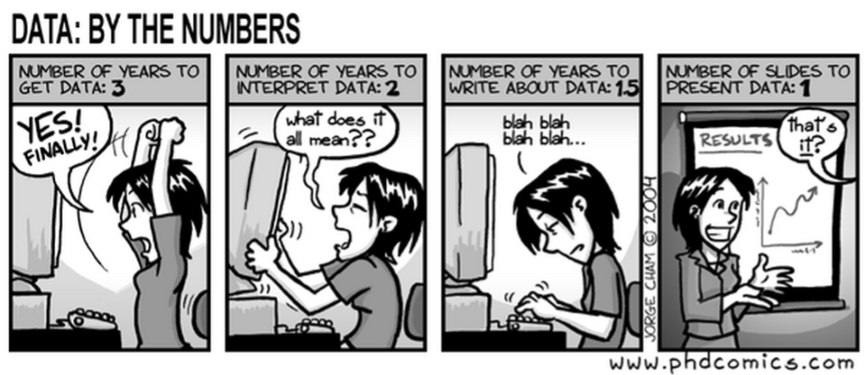

## stat133-fall-2017

This repository holds the course materials for the fall 2017 edition of 
__Statistics 133: Concepts in Computing with Data__ at UC Berkeley.

- __Instructor:__ Gaston Sanchez, gaston.stat[at]gmail.com
- __Class Time:__ MWF 4-5pm in Dwinelle 155
- __Session Dates:__ 08/23/17 - 12/08/17
- __Code #:__ 21287
- __Units:__ 3 (more info [here](http://classes.berkeley.edu/content/2017-fall-stat-133-001-lec-001))
- __Office Hours:__ TBA in 309 Evans (or by appointment)
- __Final:__ TBA
- __GSIs:__ Office hours of the GSIs will be posted on the bCourses page. 
You can go to the office hours of __any__ GSI, not just your own.

| Lab | Date       | Room         | GSI             |
|-----|------------|--------------|-----------------|
| 101 | Th 9-11am  | 342 Evans    | TBD   |
| 102 | Th 11-1pm  | 342 Evans    | TBD   |
| 103 | Th 1-3pm   | 342 Evans    | TBD   |
| 104 | Th 3-5pm   | 342 Evans    | TBD   |
| 105 | Fr 9-11am  | 342 Evans    | TBD   |
| 106 | Fr 9-11am  | 340 Evans    | TBD   |
| 107 | Fr 11-1pm  | 342 Evans    | TBD   |
| 108 | Fr 11-1pm  | 340 Evans    | TBD   |
| 109 | Fr 1-3pm   | 342 Evans    | TBD   |
| 110 | Fr 1-3pm   | 340 Evans    | TBD   |

### Philosophy

__Concepts in Computing with Data__ presents computing tools and basic concepts 
for the main stages of the _Data Analysis Cycle_ (DAC): 1) data preparation, 
2) actual analysis, and 3) reporting of results. 

Traditionally, teaching has been focused on the actual analysis part of a data 
set (e.g. description, hypothesis testing, modeling, validation) while leaving 
out the data preparation steps, as well as the presentation and reporting of results. 
This is nuts. Typically, the most time consuming parts in the _DAC_ are the 
preparation of data (e.g. cleaning, reformatting, tidying), and the report and 
communication of results (e.g. images, tables, papers, presentations, reports, docs). 
However, we don't teach students how to approach these tasks. They are left alone 
to acquire them in the wild. Stat 133 aims to add its two cents to provide solid 
foundations that will help you crunch data in a less 
improvised/naive/inefficient way.

### Description

__Stat 133: Concepts in Computing with Data__ is one of the core courses 
of the Statistics Department. 
The ultimate goal is to provide foundations for "computing with data" so students 
have the basic computational skills for subsequent 
upper division courses (e.g. Stat 150, 151A, 152, 153, 154, 155, 157, 158, 159).
This involves teaching students how to:

- use the computer extensively to conduct statistical analysis of data.
- use existing software rather than build routines from the ground up.
- focus on aspects of computing to conduct data analysis, NOT the 
computational aspects of statistical methods.

The goal is to help you gain literacy about "computing with data" with the use
of the statistical programming language __R__. 

Much of the course is about learning good practices:

- Organize your workflow
- Understand data formats
- Understand how to visualize data and display statistical information
- Learn the basic principles for writing code
- Use computational tools to carry our the data analysis cycle

### Contents

__Statistics 133__ is an introduction to computational data analysis using R 
(and other computational tools) with an emphasis on five major cornerstones:

- Data Manipulation (wrangling, reshaping, tidying)
- Data Visualization (focus on statistical charts)
- Programming Concepts (with emphasis on data analysis)
- Data Technologies (various sources/formats of data)
- Reporting Tools (via dynamic documents)

For more details, check the [syllabus](syllabus/README.md)

### Prerequisites / Review

This course does not have any prerequisites, although it would be nice if you 
have taken an introductory course in statistics (e.g. Stat 2, 20, 21, 131A). 

The curriculum and format is designed specifically for students (ideally 
majoring in Statistics) who have NOT taken computer science courses.

You don't need previous programming experience, and you also don't need previous
data analysis experience. However, students with some exposure to programming
concepts, and data analysis tend to understand certain concepts better.

Students with some prior experience in either computational statistics 
or computing are welcome to enroll, though some parts of the course will be slow. 
Students who have taken computer science courses (e.g. CS C8, CS C100, CS 9H) 
should instead take a more advanced course.

### Expectations

We expect that, at the end of the course, you have a basic understanding of R. 
But more important, we expect that you understand the general principles of 
data analysis projects, independently of the programming
language that you use.

After completing the course, we expect that you feel comfortable in any of 
the three stages of the _Data Analysis Cycle (DAC)_. This means that 
you can take almost any data set(s), clean it, tidy it, get visualizations, 
write code, and report the results in a varied number of formats.

We don't expect you to become a jedi data scientist, an R ninja, or a super coder. 
That takes YEARS of practice, training, learning, and collaborating. Instead, 
we want you to become a skilled [padawan](http://starwars.wikia.com/wiki/Padawan) 
analyst (which, if interested, can be prepared to take the next steps of a data 
science marathon race).

### Methods of Instruction

We will be using a combination of materials such as slides, tutorials, 
reading assignments, and chalk-and-talk.

The main computational tool will be the [computing and programming environment R](https://www.r-project.org/). 
The main workbench will be the IDE [RStudio](https://www.rstudio.com/).
You will also use a terminal emulator to work with command line.

### Other

- Please read the course [logistics and policies](syllabus/policies.md) for mode details
about the structure of the course, DO's and DONT's, etc.

- I've prepared a list of [Frequently Asked Questions](syllabus/faqs.md) that I get asked 
most of the times.

-----

### License

 Unless otherwise noticed, this work, by Gaston Sanchez, is licensed under a <a rel="license" href="http://creativecommons.org/licenses/by-sa/4.0/">Creative Commons Attribution-ShareAlike 4.0 International License</a>.

Author: [Gaston Sanchez](http://gastonsanchez.com)
