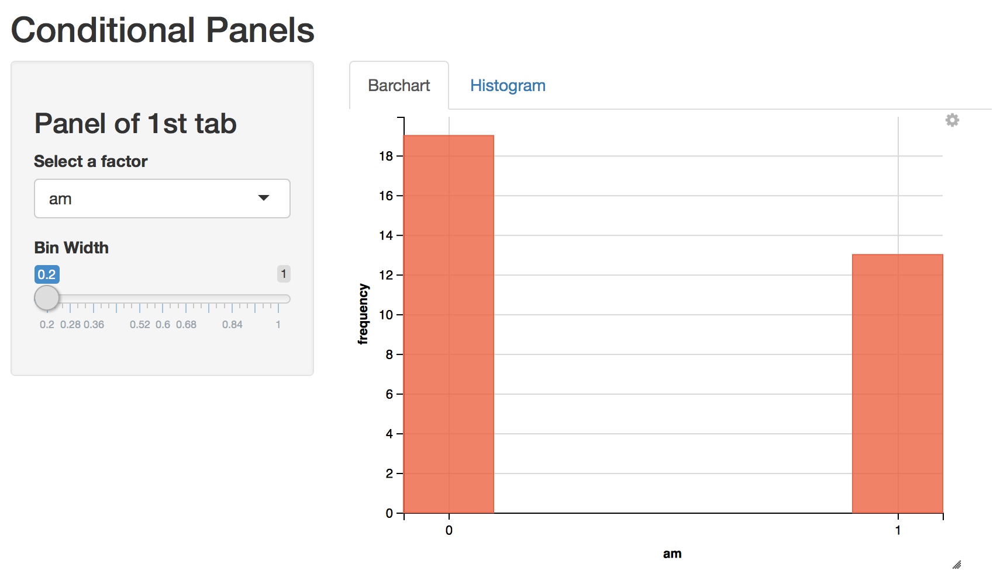
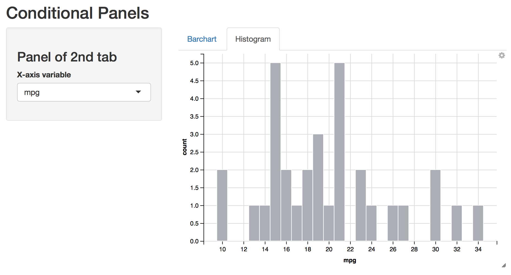

## Conditional Panel App

This shiny app contains two tabs (see screenshots below)

- Tab for barcharts




- Tab for histograms




- Tabs are defined with the function: `tabsetPanel()`
- Each tab shows a different sidebar panel.
- The sibar bar panels are handled with `conditionalPanel()`
- [Conditional Panel demo](https://shiny.rstudio.com/gallery/conditionalpanel-demo.html) from Shiny RStudio
- Here's a [youtube video](https://www.youtube.com/watch?v=tGR7ysJlZHU&t=31s) with an example of conditional panels (by Abhinav Agrawal)


## Running the app

Assuming that you have both R and RStudio, the other thing you need is the R package `"shiny"`. In case of doubt, run:

```R
install.packages("shiny")
```

The easiest way to run an app is with the `runGitHub()` function from the `"shiny"` package. 

```R
library(shiny)

# Run an app from a subdirectory in the repo
runGitHub("stat133-fall-2017", "ucb-stat133", subdir = "apps/conditional-panels")
```

