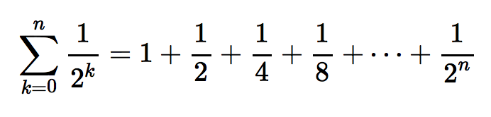
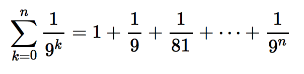
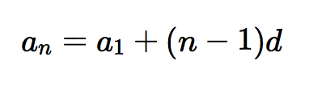
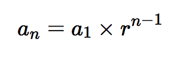
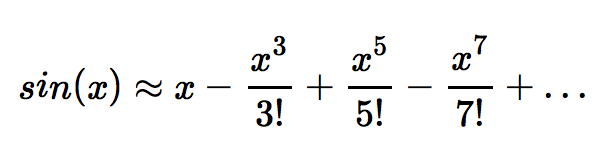
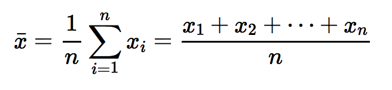
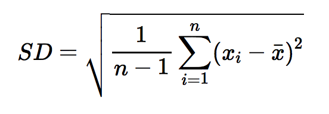
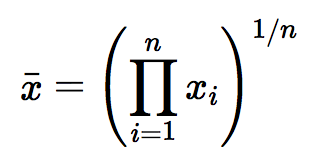

Lab 8: Simple Loops
================
Gaston Sanchez

> ### Learning Objectives
>
> -   Practice writing simple loops
> -   Get familiar with the syntax of a `for` loop
> -   Get familiar with the syntax of a `while` loop
> -   Get familiar with the syntax of a `repeat` loop
> -   Encapsulate loops inside a function call

------------------------------------------------------------------------

Introduction
------------

The majority of functions that work with vectors are vectorized. Remember that vectorized operations are calculations that are applied to all the elements in a vector (element-wsie operations).

In order to learn about loops and iterations, it's good to forget about vectorized operations in R. This means that you will be asked to write code, using some sort of loop structure, to perform tasks for which there is already a vectorized implementation. For example, in this lab you will have to write code with various types of loops to calculate the mean of a numeric vector. This can easily be done using the function `mean()`. But we don't want you to use `mean()`. We want to think about control-flow structures, which are essential in any programming activity.

For loops
---------

Let's start with a super simple example. Write a `for` loop to add 1 to every element of a vector.

``` r
vec <- c(3, 1, 4) # Change this value!

for (j in c()) { # Replace c() with an appropriate sequence.
  # Fill in.
  
}
```

Now rewrite the code, using a `for` loop, in order to triple every element in `vec`

``` r
vec <- c(3, 1, 4) # Change this value!

for (j in c()) { # Replace c() with an appropriate sequence.
  # Fill in.
  
}
```

------------------------------------------------------------------------

Summation Series
----------------

Write a for loop to compute the following series. Test your code with different values for *n*. Does the series converge as *n* increase?



$$
\\sum\_{k=0}^{n} \\frac{1}{2^k} = 1 + \\frac{1}{2} + \\frac{1}{4} + \\frac{1}{8} + \\dots + \\frac{1}{2^n}
$$

Write a for loop to compute the following series. Test your code with different values for *n*. Does the series converge as *n* increase?



$$
\\sum\_{k=0}^{n} \\frac{1}{9^k} =1 + \\frac{1}{9} + \\frac{1}{81} + \\dots + \\frac{1}{9^n}
$$

### Arithmetic Series

Write a for loop to compute the following arithmetic series *a*<sub>*n*</sub> = *a*<sub>1</sub> + (*n* − 1)*d*



*a*<sub>*n*</sub> = *a*<sub>1</sub> + (*n* − 1)*d*

when *a*<sub>1</sub> = 3, and *d* = 3. For instance: 3 + 6 + 12 + 24 + …. Test your code with different values for *n*. Does the series converge as *n* increase?

### Geometric Sequence

A sequence such as 3, 6, 12, 24, 48 is an example of a geometric sequence. In this type of sequence, the *n*-th term is obtained as:



*a*<sub>*n*</sub> = *a*<sub>1</sub> × *r*<sup>*n* − 1</sup>

where: *a*<sub>1</sub> is the first term, *r* is the common ratio, and *n* is the number of terms.

Write a for loop to compute the sum of the first *n* terms of: 3 + 6 + 12 + 24 + …. Test your code with different values for *n*. Does the series converge as *n* increase?

``` r
a1 <- 3
r <- 2
summ <- 0

for (n in 1:10) {
  an = a1 * r^(n-1)
  summ = summ + an
  print(an)
}
```

    ## [1] 3
    ## [1] 6
    ## [1] 12
    ## [1] 24
    ## [1] 48
    ## [1] 96
    ## [1] 192
    ## [1] 384
    ## [1] 768
    ## [1] 1536

------------------------------------------------------------------------

Sine Approximation
------------------

Consider the following series that is used to approximate the function *s**i**n*(*x*):



$$
sin(x) \\approx x - \\frac{x^3}{3!} + \\frac{x^5}{5!} - \\frac{x^7}{7!} + \\dots
$$

Write a `for` loop to approximate *s**i**n*(*x*). Try different number of terms, *n* = 5, 10, 50, 100. Compare your loop with the `sin()` function.

``` r
# Your for loop
```

------------------------------------------------------------------------

Dividing a number by 2 multiple times
-------------------------------------

The following exercises involve dividing a number by 2 until it becomes odd.

### Using a `repeat` loop

``` r
# Divide a number by 2 until it becomes odd.
val_rep <- 898128000 # Change this value!

repeat {
  print(val_rep)
  if (val_rep %% 2 == 1) { # If val_rep is odd,
    break                  # end the loop.
  }
  val_rep <- val_rep / 2 # Divide val_rep by 2 since val_rep was even.
  # When the end of the loop is reached, return to the beginning of the loop.
}
```

    ## [1] 898128000
    ## [1] 449064000
    ## [1] 224532000
    ## [1] 112266000
    ## [1] 56133000
    ## [1] 28066500
    ## [1] 14033250
    ## [1] 7016625

### Using a `while` Loop

``` r
# Divide a number by 2 until it becomes odd.
val_while <- 898128000 # Change this value!

while (val_while %% 2 == 0) { # Continue the loop as long as val_while is even.
  print(val_while)
  val_while <- val_while / 2
}
```

    ## [1] 898128000
    ## [1] 449064000
    ## [1] 224532000
    ## [1] 112266000
    ## [1] 56133000
    ## [1] 28066500
    ## [1] 14033250

``` r
print(val_while)
```

    ## [1] 7016625

Make a `reduce()` function
--------------------------

Now generalize the above code to create a function `reduce()` which performs the same operation. (You should change very little.)

``` r
# your reduce() function
reduce <- function(x) {
  # Fill in.
  while(x %% 2 == 0) {
    x <- x / 2
  }
  return(x)
}

reduce(898128000)
```

    ## [1] 7016625

------------------------------------------------------------------------

Average
-------

The average of *n* numbers *x*<sub>1</sub>, *x*<sub>2</sub>, …, *x*<sub>*n*</sub> is given by the following formula:



$$
\\bar{x} = \\frac{1}{n} \\sum\_{i=1}^{n} x\_i = \\frac{x\_1 + x\_2 + \\dots + x\_n}{n}
$$

Write R code, using each type of loop (e.g. `for`, `while`, `repeat`) to implement the arithmetic mean of the vector `x = 1:100`

Standard Deviation
------------------

The sample standard deviation of a list of *n* numbers *x*<sub>1</sub>, *x*<sub>2</sub>, …, *x*<sub>*n*</sub> is given by the following formula:



$$
SD = \\sqrt{ \\frac{1}{n-1} \\sum\_{i=1}^{n} (x\_i - \\bar{x})^2 }
$$

Write R code, using each type of loop (e.g. `for`, `while`, `repeat`) to implement the sample standard deviation of the vector `x = 1:100`

Geometric Mean
--------------

The geometric mean of *n* numbers *x*<sub>1</sub>, *x*<sub>2</sub>, …, *x*<sub>*n*</sub> is given by the following formula:



$$
\\bar{x} = \\left ( \\prod\_{i=1}^{n} x\_i \\right )^{1/n}
$$

Write R code, using each type of loop (e.g. `for`, `while`, `repeat`) to implement the geometric mean of the vector `x = 1:50`
