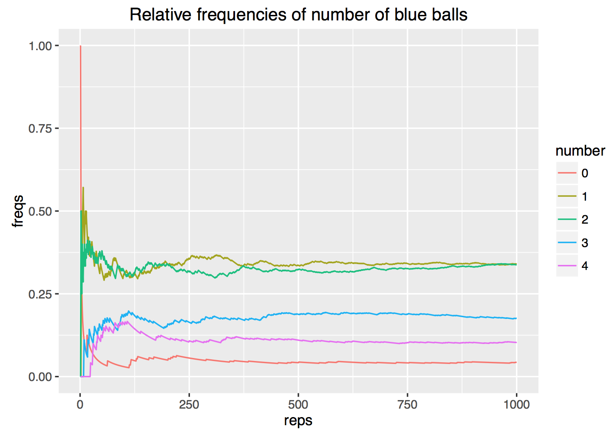
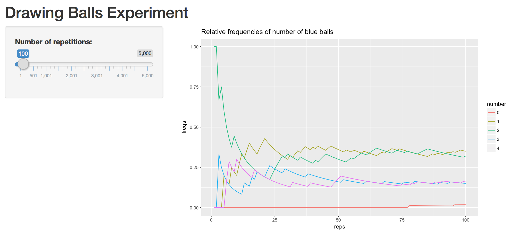
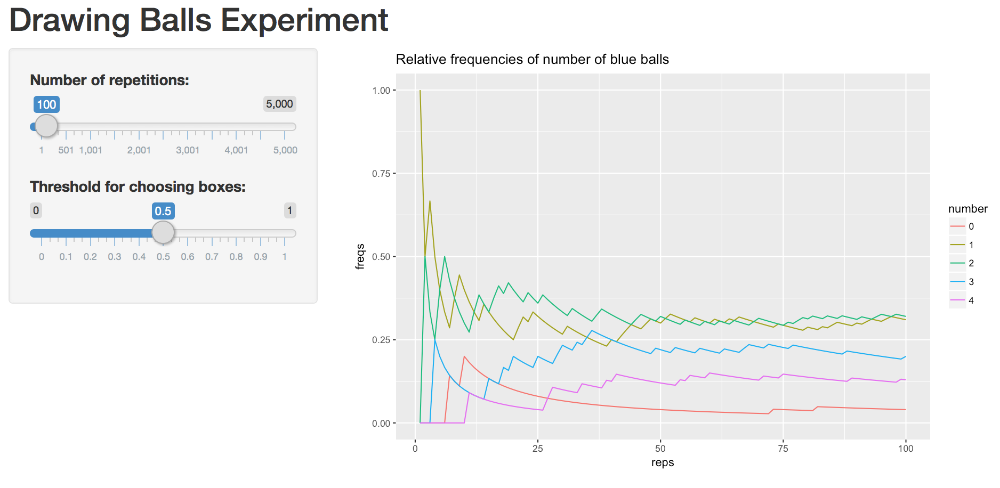

Lab 9: Random Number and Simulations
================
Gaston Sanchez

> ### Learning Objectives
>
> -   getting started with simulations in R
> -   learn how to create a basic shiny app
> -   put in practice concepts from your introductory statistics course(s)

------------------------------------------------------------------------

Introduction
============

Random numbers have many applications in science and computer programming, especially when there are significant uncertainties in a phenomenon of interest.

Computing Probabilities
=======================

With the mathematical rules from probability theory we can compute the probability that a certain event happens. Consider for example two bags containing balls of different colors. Bag 1 contains 2 white balls and 1 red ball; bag 2 contains 3 white balls and 1 red ball.

Suppose that a bag is chosen at random, and then a ball is picked at random from the selected bag. What is the given probability that:

1.  the ball chosen is red
2.  the ball chosen is white

This problem can be solved analytically using the formulas:

    P(red) = P(red | bag1) P(bag1) + P(red | bag2) P(bag2)

    P(white) = P(white | bag1) P(bag1) + P(white | bag2) P(bag2)

Instead of solving this problem analytically, you can write R code to simulate the experiment of picking a bag and drawing a ball. The first step consists of creating two bags as character vectors with the name of the colors for the balls:

``` r
# bags
bag1 <- c('white', 'white', 'red')
bag2 <- c(rep('white', 3), 'red')
```

To compute the probability using simulations, we need to replicate the random experiments a large number of times (e.g. 500 or 1000 times).

``` r
bags <- c('bag1', 'bag2')
repetitions <- 1000
drawn_balls <- character(repetitions)

set.seed(345)
for (i in 1:repetitions) {
  # select one bag
  chosen_bag <- sample(bags, 1)
  
  # draw a ball from chosen bag
  if (chosen_bag == 'bag1') {
    drawn_balls[i] <- sample(bag1, 1)
  } else {
    drawn_balls[i] <- sample(bag2, 1)
  }
}

table(drawn_balls) / repetitions
```

    ## drawn_balls
    ##   red white 
    ## 0.263 0.737

A less basic probability problem
================================

You can manually find the probabilities of the previous example. However, not all real problems have an analytic solution. Consider the following situation. There are two boxes with balls of different colors. Box 1 contains two `blue` balls, and one `red` ball. Box 2 contains two `blue` balls, three `red` balls, and one `white` ball.

The random experiment consists of generating a random number that follows a uniform distribution (min = 0, max = 1). If the number is greater than 0.5, then a sample **with replacement** of size 4 is drawn from box 1. If the random number is less than or equal to 0.5, then a sample **without replacement** of size is drawn from box 2. The goal is to find the probability distribution for the number of blue balls. In other words:

-   Probability of 0 blue balls
-   Probability of 1 blue ball
-   Probability of 2 blue balls
-   Probability of 3 blue balls
-   Probability of 4 blue balls

### Your Turn

1.  Create two character vectors `box1` and `box2` with colors of balls:

``` r
# your vectors box1 and box2
```

1.  The random experiment involves generating a uniform random number using `runif(1)`. If this number is greater than 0.5, get a `sample()` without replacement of `size = 4` from `box1.` Otherwise, get a `sample()` without replacement of `size = 4` from `box2`.

``` r
# your code to simulate one random experiment
```

1.  Repeat the experiment 1000 times using a `for` loop. To store the drawn samples, use a matrix `drawn_balls`. This matrix will have 1000 rows and 4 columns. In each row you assign the output of a random sample of balls.

``` r
# your code to draw the balls according to the random experiment
# (repeated 1000 times)
```

Your matrix `drawn_balls` could look like this (first five rows):

         [,1]   [,2]    [,3]    [,4]   
    [1,] "blue" "red"   "red"   "blue" 
    [2,] "red"  "blue"  "white" "red"  
    [3,] "red"  "blue"  "red"   "red"  
    [4,] "red"  "red"   "red"   "blue" 
    [5,] "red"  "red"   "blue"  "white"

1.  Once you filled the matrix `drawn_balls`, compute the proportion of samples containing: 0, 1, 2, 3, or 4 blue balls.

1.  Try to obtain the following plot showing the relative frequencies of number of blue balls over the series of repetitions.



------------------------------------------------------------------------

Shiny App
---------

-   Open RStudio.
-   Go to the **File** option from the menu bar.
-   Select **New File** and choose **Shiny Web App**.
-   Give a name to your App, choose a location for it, and click the **Create** button.

These steps should create a new folder in the specified directory containing an R script file called `app.R`. This file contains a basic template with the following main ingredients:

-   a call to `library(shiny)` at the top of the file
-   the User Interface "function" `ui <- fluidPage(...)`
-   the Server "function" `server <- function(input, output) {...}`
-   a call to `shinyApp(ui = ui, server = server)` to run your app

By default, shiny creates a basic template with a histogram of the variable `waiting` from the data set `faithful`. You can try running the app by clicking on the **Run App** button (see buttons at the top of the source pane).

App scripts
-----------

Instead of using the default `app.R` script, you will be playing with your own scripts to simulate the random experiment of drawing 4 balls from the boxes.

While working on this part of the lab, you may want to look at the [Shiny Widgets Gallery](https://shiny.rstudio.com/gallery/widget-gallery.html)

### App version 1

Try to create a shiny app that replicates the image below:

-   there is only one widget input: slider that controls the number of repetitions



### App version 2

Modify the first app to create a second shiny app that replicates the image below:

-   widget input: slider that controls the number of repetitions
-   widget input: slider that controls the probability threshold for choosing the boxes.



### App version 3

Modify the second app to create a third shiny app that replicates the image below:

-   widget input: slider that controls the number of repetitions
-   widget input: slider that controls the probability threshold for choosing the boxes.
-   widget input: numeric input that controls the random seed.


------------------------------------------------------------------------

### App R scripts

In the folder of this lab, you will find several app R scripts: `app1.R`, `app2.R`, `app3.R`, and `app4.R`. Each of them adds a new element to the sidebar, so that your app becomes more flexible.

-   `app1.R`: basic skeleton that includes input for number of repetitions
-   `app2.R`: includes input for threshold criteria to select a box
-   `app3.R`: includes input for random seed

The file `app4.R` is a bit more complex. First, we redefine `toss()` by adding another argument for the random seed. Notice also the use of `reactive()` to create reactive objects `tosses()` and `proportions()`. Likewise, in the main panel of outputs, we display a data table showing summary results.
