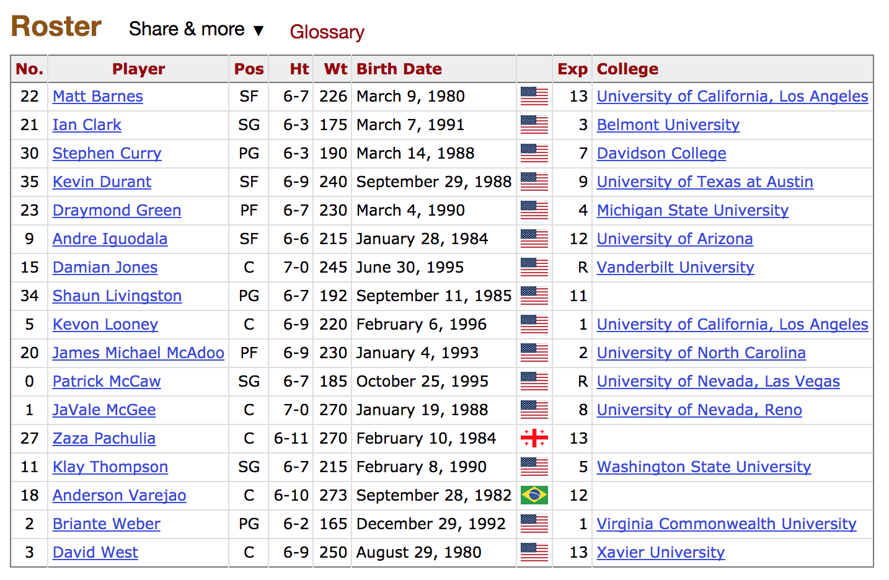
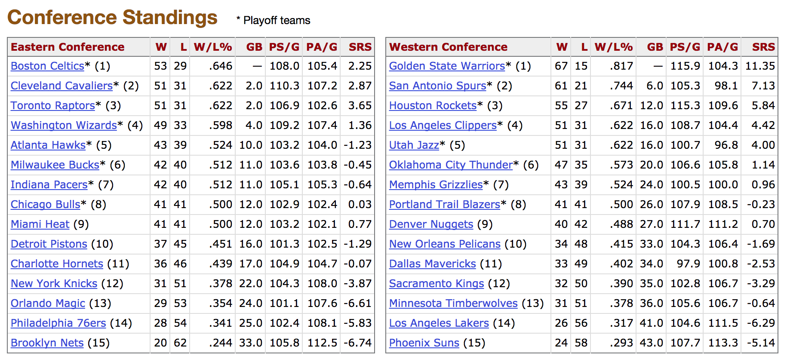
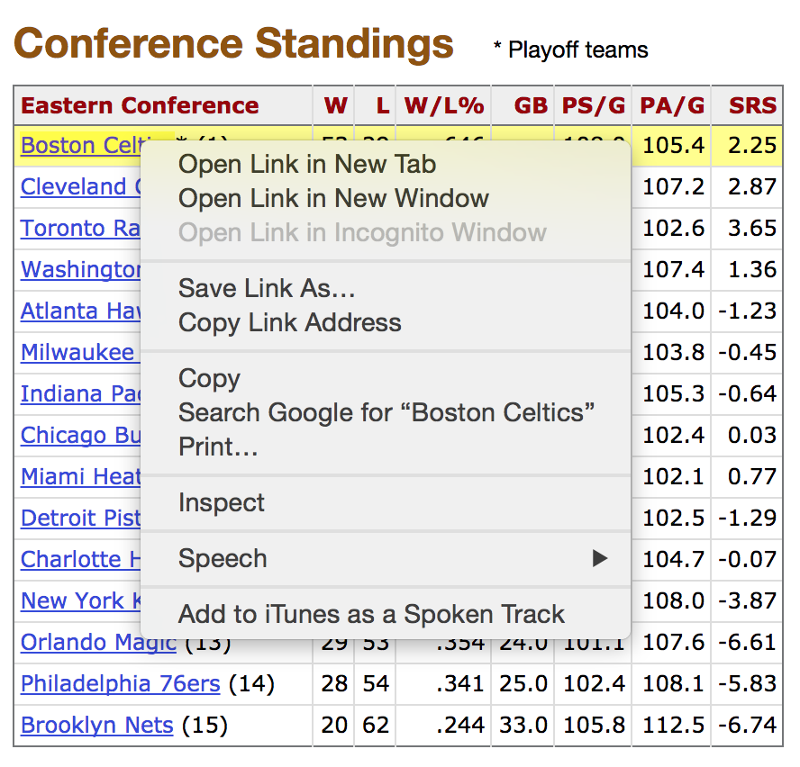
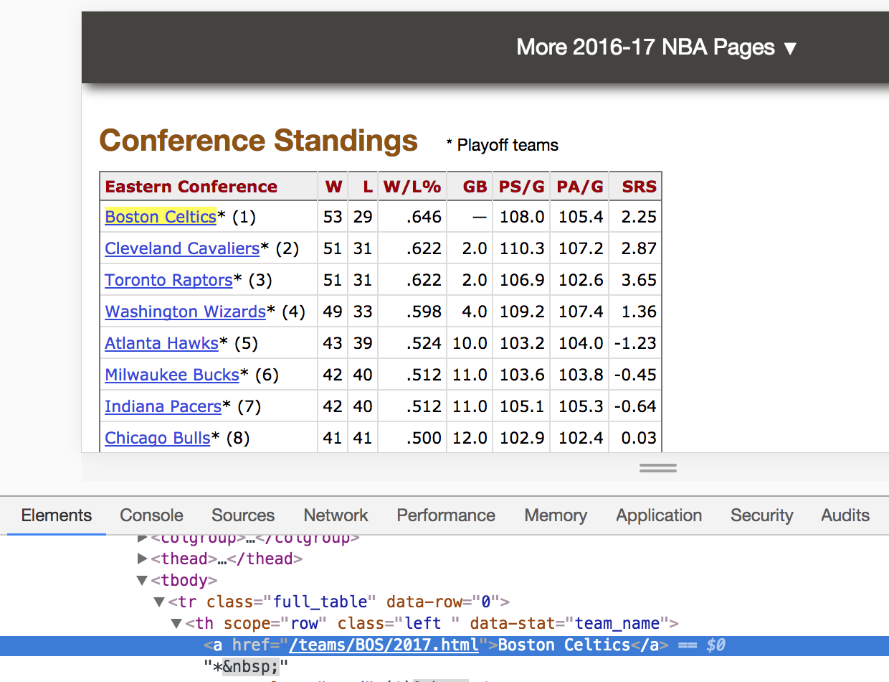

> ### Learning Objectives
>
> - Work with the package `"rvest"`
> - Learn to extract html elements and attributes
> - Create a simple crawler

```{r setup, include=FALSE}
knitr::opts_chunk$set(echo = TRUE, fig.path = 'lab12-images/')
library(XML)
library(xml2)
library(rvest)
library(stringr)
library(magrittr)
```

------

## Required Packages

In this lab, you will have to load the following R packages:

```{r eval = FALSE}
library(XML)
library(xml2)
library(rvest)
library(magrittr)
```


## Motivation

The goal of this lab is to extract the Roster Tables of all the NBA teams
from the website https://www.basketball-reference.com/

More specifically, you will extract the rosters of the season 2016-2017. One 
example of such table is displayed in the image below with the Roster of 
Golden State Warriors (GSW): 



The GSW Roster table is in the URL:

https://www.basketball-reference.com/teams/GSW/2017.html

You can read this table in R via the `"XML"` function `readHTMLTable()`:

```{r eval = FALSE}
# Assemble url (so it fits on screen)
basket <- "https://www.basketball-reference.com"
gsw <- "/teams/GSW/2017.html"
gsw_url <- paste0(basket, gsw)

# download HTML file to your working directory
download.file(gsw_url, 'gsw-roster-2017.html')

# Read GSW Roster html table
gsw_roster <- readHTMLTable('gsw-roster-2017.html')
```

If you inspect the contents of `gsw_roster` you should be able to see some 
content like this:

```{r echo = FALSE}
gsw_roster <- readHTMLTable('../data/gsw-roster-2017.html')
gsw_roster
```


### Roster tables

Say you are interested in obtaining the Roster table for the Boston Celtics (BOS).
You could get such table by adapting the code used to get the GSW roster. The
only thing you need to change is the team abbreviation from `GSW` to `BOS`:

```{r eval = FALSE}
# Assemble url (so it fits on screen)
basket <- "https://www.basketball-reference.com"
bos <- "/teams/BOS/2017.html"
bos_url <- paste0(basket, bos)

# download HTML file to your working directory
download.file(bos_url, 'bos-roster-2017.html')

# Read BOS Roster html table
bos_roster <- readHTMLTable('bos-roster-2017.html')
```

In order to get the Roster tables of all the NBA teams, you would need to 
repeat the same operation with the corresponding team abbreviations. But how
do you get these abbreviations in a programmatic way?


## 2016-17 NBA Season Summary

To get the team abbreviations in a programmatic way, you need to find URLs
of the form `"/teams/GSW/2017.html"`, `"/teams/BOS/2017.html"`, etc. These 
pieces of information are available in the Basketball-Reference website in
several web pages.

One of those web pages is the _2016-17 NBA Season Summary_ which can be 
accessed in the following URL:

[https://www.basketball-reference.com/leagues/NBA_2017.html](https://www.basketball-reference.com/leagues/NBA_2017.html)

In particular, this page contains information about the _Conference Standings_ 
displayed in two HTML tables (see screenshot below)



We don't really care about the conference standings. What we care about is that 
these two HTML tables contain both: the names of the NBA teams (rendered on
your browser), as well as the href attributes of the form: `"/teams/GSW/2017.html"`.

If you use Google Chrome as your web browser, you can inspect the HTML source
code by right clicking on your mouse, and selecting the `Inspect` option. 
For instance, place the cursor over the _Boston Celtics_ link, and then launch
the inspector:



If you look at the HTML source, you will see the `href` attributes for each 
team page. In other words, these are the links to each team's web page.
And this is exactly the piece of information we are looking for: the team 
abbreviations.




## Extracting HTML elements

```{r echo = FALSE}
xml_doc <- read_html('../data/nba2017-conference-standings.html')
```

So how do we extract these `href` attributes? The first step is to read the 
contents of the html file:

https://www.basketball-reference.com/leagues/NBA_2017.html

This can be done with the function `read_html()`

```{r eval = FALSE}
nba_html <- paste0(basket, "/leagues/NBA_2017.html")

xml_doc <- read_html(nba_html)
```

The object `xml_doc` is an object of class `"xml_document"`. If you are 
curious about extracting all the content in a character vector, then use 
the function `html_text()`, chained with the pipe `%>%` operator:

```{r eval = FALSE}
xml_text <- xml_doc %>% html_text()
```

The object `xml_text` is a character vector that contains the content of 
the html file.


### Extracting elements `h2`

Before attempting extracting the href attributes, let's begin with something
simpler. For example, let's see how to extract the value of all the HTML elements __h2__ 
(i.e. headings of level 2). This can be done with the function `html_nodes()`, 
and then `html_text()`

```{r}
# content of h2 nodes
xml_doc %>%
  html_nodes("h2") %>%
  html_text() 
```

You can pass the name of an HTML element (i.e. a tag or node) to `html_nodes()`.
In this case, we indicate that we want to locate the nodes `"h2"`. And then
we call `html_text()` to _extract_ the actual content in those nodes.


### Your turn

Use `html_nodes()` and `html_text()` to extract the values of nodes:

- `"h1"`
- `"strong"`
- `"button"`

-----

What if you want to extract HTML tags or nodes that have an attribute? 
For instance, if you look at the source code, starting at line 356 you
will see the following HTML elements for _Player Stats_:

```html
<p class="listhead"><strong>Player Stats</strong></p>
	<ul class="">
		<li><a href="/leagues/NBA_2017_per_game.html">Per Game</a></li>
		<li><a href="/leagues/NBA_2017_totals.html">Totals</a></li>
		<li><a href="/leagues/NBA_2017_per_minute.html">Per 36 Minutes</a></li>
		<li><a href="/leagues/NBA_2017_per_poss.html">Per 100 Possessions</a></li>
		<li><a href="/leagues/NBA_2017_advanced.html">Advanced</a></li>
	</ul>
```

As you can tell, there is a `p` element (i.e. html paragraph) of class 
`"listhead"`. You can actually specify this type of node with the name of the
html element, followed by a dot, followed by the name of the attribute:

```{r}
# node with an attribute
xml_doc %>%
  html_nodes("p.listhead") %>%
  html_text()
```


## XPath

In order to specify HTML elements that are embeded inside other HTML elements,
you need to use __XPaths__. 

XPath expressions have a syntax similar to the way files are located in a 
hierarchy of directories/folders in a computer file system. To be more precise,
Xpath expressions allow you to indicate the 
specific _path_ that must be taken to arrive at a given node.

In general, we can specify paths through the tree structure:

- based on node names
- based on node content
- based on a node's relationship to other nodes

| Symbol  | Description                |
|---------|----------------------------|
|  `/`    | selects from the root node |
|  `//`   | selects nodes anywhere     |
|  `.`    | selects the current node   |
|  `..`   | Selects the parent of the current node |
|  `@`    | Selects attributes         |
|  `[]`   | Square brackets to indicate attributes |


Let's go back to the `p.listhead` nodes. These can be extracted with an Xpath expression like this:

```{r}
xml_doc %>%
  html_nodes(xpath = '//p[@class="listhead"]') %>%
  html_text()
```

The XPath `'//p[@class="listhead"]'` means that we want to locate, anywhere in 
the tree (`//`), all `<p>` nodes that have an attribute named `class` that 
takes the value `"listhead"`.

What if you want to extract the `<a>` values inside the listed items `<li>`, 
within the unlisted list `<ul>`?

```{r}
xml_doc %>%
  html_nodes(xpath = '//ul[@class=""]/li/a') %>%
  html_text()
```

or equivalently:

```{r}
xml_doc %>%
  html_nodes(xpath = '//ul[@class=""]//a') %>%
  html_text()
```


## Extracting `href` attributes

Let's focus again on the first two html tables of the page
https://www.basketball-reference.com/leagues/NBA_2017.html.

To extract the first `"table"` you can use `html_nodes()` and `extract()` as follows:

```{r}
# extracting first table 
xml_table1 <- xml_doc %>%
  html_nodes("table") %>%
  extract(1)

class(xml_table1)
```

The object `xml_table1` is not really an R table, but an object of class 
`xml_nodeset`. To extract the html table as a data frame, `"rvest"` provides 
the function `html_table()`:

```{r}
tbl1 <- html_table(xml_table1)

head(tbl1)
```


Likewise, the second html table can be extracted (as an `xml_nodeset`) in the following way:

```{r}
# extracting second table 
xml_table2 <- xml_doc %>%
  html_nodes("table") %>%
  extract(2)
```

Actually, both tables can be extracted simultaneously:

```{r}
# two html tables
xml_tables <- xml_doc %>%
  html_nodes("table") %>%
  extract(1:2)
```

Having extracted the tables we are interested in, we can select the `<a>` nodes, and then extract the content that corresponds to the name of the teams:

```{r}
# extract names of teams
xml_tables %>% 
  html_nodes("a") %>%
  html_text()
```

In order to get the `href` attributes we need to use the `html_attr()` function:

```{r}
# href attributes
xml_tables %>% 
  html_nodes("a") %>%
  html_attr("href")
```

Bingo!!!


-----


## Your turn

- Store the href attributes in a character vector `hrefs`.
- Use string manipulation functions to create a character vector `teams` that 
contains just the team abbreviations: e.g. `"BOS", "CLE", "TOR", ...`
- Create a character vector `files` with elements:
`"BOS-roster-2017.csv", "CLE-roster-2017.csv", "TOR-roster-2017.csv", ...`
- Use the object `basket` and the first element of `hrefs` (i.e. `hrefs[1]`) to 
assemble a `team_url` like the one used for `gsw_url`:
```
# modify with `hrefs[1]`
basket <- "https://www.basketball-reference.com"
gsw <- "/teams/GSW/2017.html"
gsw_url <- paste0(basket, gsw)
```
- Read the html document of `team_url`.
- Use `html_table()` to extract the content of the html table as a data frame called `roster`.
- Store the data frame in a csv file: `"BOS-roster-2017.csv"`.

Having making sure that your code above works, now generalize it to more teams. In theory, your code should be able to collect all 30 roster tables. However, since everyone will be making constant requests to the _basketball-reference_ website at the same time, write code that scrapes a couple of roster tables (e.g. 5 or 7 teams).

- Create a `for ()` loop to extract a handful of the roster tables as data frames.
- Store each table in its own csv file: e.g. `"GSW-roster-2017.csv"`


### Challenge

Using all the saved csv files, how would you build a global table containing the extracted rosters, in a way that this table would also have a column for the team?

Try getting such a global table and save it in a file `nba-rosters-2017.csv`
