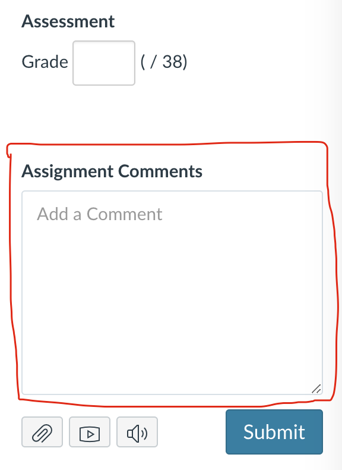

## Stat 133 Course Logistics and Policies

-----

As Stat 133 gets larger and larger every year, running the course as smoothly as possible becomes more challenging. Please take some time to carefully read all the course policies. They should let you know what the game rules are, the _do's_ and _dont's_, and what to expect. While writing this document, I've tried to be as comprehensive and clear as possible, leaving little room for misinterpretation. In case of doubt, contact me or any member of the GSI staff.

- [Labs](#labs)
- [Homework](#homework)
- [Assignments Grading](#assignments-grading)
- [Posts](#posts)
- [Tests](#tests)
- [Oral Evaluation](#oral-evaluation)
- [Learning Cooperatively](#learning-cooperatively)
- [Academic Honesty](#academic-honesty)
- [Email Policy](#email-policy)
- [Special Accommodations](#special-accommodations)
- [Incomplete Grade](#incomplete-grade)
- [Safe and Inclusive Environment](#safe-and-inclusive-environment)
- [Letters of Recommendation](#letters-of-recommendation)
- [Fine Print](#fine-print)

-----

### Labs

- Weekly labs are a required part of the course and they are meant to supplement lecture.
- You must attend the discussion group you are officially registered in.
- Do not take the class if you cannot attend the discussion you are registered in.
- You will be encouraged to problem solve individually or in groups.
- Each person must submit each lab independently to their github account, but you are welcome to collaborate with other students in your lab room.
- To receive credit, you must attend lab, work on the lab assignment until you're finished or the lab period is over, and get checked off by a course staff member.
- If you finish the lab early, we encourage you to help others with their lab.
- From Sep-11, if you miss
    + one lab, you get full lab credit (10% of total grade).
    + two labs,  you get half lab credit (5% of total grade).
    + three labs, you get no lab credit (0% of total grade, cannot get an A in the course).
    + four or more labs, you fail the class (F grade).
- To receive full credit, you must be present for the entire time of the lab (partial credit for partial attendance 50%).
- Two labs with partial credit account as one lab absence.
- There will be about 4 short quizzes given in discussion to test your understanding.
- Your quiz scores __will NOT__ be part of your grade.
- During lab, we will look at your work (e.g. how you code, what you are doing, how you approach problems), and we will take notes that will be used to assess part of your performance in the course.

### Homework

- Homework assignments will be assigned almost every two weeks.
- The first two HW will not be part of your grade. These are "warming-up" assignments.
- Each assignment will be graded out of four points: 
	- __completeness__: one point for making a good-faith effort at every part of the assignment.
	- __correctness__: one point for technically-correct, working solutions to each part.
	- __coding__: one point for clean, well-formatted, easily readable code.
	- __description__: one point for clear descriptions, interpretations, explanations.
- You will submit your homework to your private Github repository. 
- You should also submit the github's link of your assignment to bCourses.
- Don't wait until the last hour to do an assignment. Plan ahead and pace yourself.
- Don't wait until the last minute to push your commits.
- __No late assignments__ will be accepted, for any reason, including, but not 
limited to, Internet congestion, system crashes, natural disasters, 
theft, medical emergencies, personal crisis, theft or any extraordinary 
circumnstances (e.g. illnes, exhaustion, mourning, loss of internet connection, bCourses is down, broken computer). Don't ask. I won't be sympathetic.
- I will drop the lowest score among the first three assignments (HW01, HW02, and HW03).
- The homework assignments will get substantially more difficult as we
progress with the course.
- If you collaborate with other students when working on a HW assignment, please include the names of those students in your submission.
- You must write your own answers (using your own words). Copy and plagiarism will not be tolerated (see _Academic Honesty_ policy).
- Learning programming is frustrating, but it can be fun.
- Homework assignments are __NOT__ eligible for regrades.

### Assignments Grading

- The primary way that the homework will be graded is by yourselves.
- Usually, you need to "turn in" (via github) both your code and outputs in the form of an `.Rmd` file and the corresponding knitted file (.`md` or `.pdf` format), or any other required files.
- Any homework submissions  without both the `.Rmd` file and the knitted file (or any other required output file), will receive a zero.
- You should grade the work as it appears in the _status_ of the closest commit before the deadline, of your github repository. 
- __No late submission:__ you should NOT grade any pushed commits after 11:59 PM of the HW deadline.
- After the HW deadline, a rubric with the solutions will be posted on bCourses (in the __Files__ section). You will then be expected to read them and enter your own scores and comments for (every part) of every problem in the homework on a simple coarse scale:
    + __0__ = Didn't attempt or very wrong,
    + __half credit__ = Mostly right but a minor thing missing or somewhat wrong,
    + __full credit__ = 100% correct.
- In case there is a cascading error, you don't need to penalize multiple times. Just indicate the source of the error, and then give full credit for the other dependent parts as long as your work and code are consistent.
- To submit your grade, use the _Assignment Comments_ section (associated to the corresponding assignment on bCourses) to enter the grade for each part justified with a comment, and a total score. 

- Note: If you are really confused about how to grade a particular problem, you should post on [Piazza](https://piazza.com/class/j6nzkfrb2p724n). This is not supposed to be a stressful process.
- Your self-grades will be due three days after the homework deadline at 11:59 PM sharp.
- If you don't enter a proper grade by this deadline, you are giving yourself a zero on that assignment.
- We will review your grade and adjust it if necessary.
- Merely doing the homework is not enough, you must do the homework; turn it in on time; read the solutions; do the self-grade; and turn it in on time. Unless all of these steps are done, you will get a zero for that assignment.

### Posts

- There will be two post assignments (due at the end of October and November).
- Posts are mastery-oriented goals.
- You will have to write two posts based on one or more of the five major course themes:
  + Data Visualization
  + Data Manipulation (reshaping, wrangling, formatting, tidying)
  + Programming for data analysis
  + Data Technologies
  + Reporting Tools
- Each post is worth 7.5%
- You will have the opportunity to expand your knowledge, researching a specific topic, and going further from what will be covered in the course.
- See the [posts](posts.md) section to know more about them.

### Tests

- There will be one 50-minute in-class midterm, and one 3-hour final exam.
- The date of the midterm is Friday October 13th. 
- The final exam is currently scheduled for Day, Dec 15th from 8am to 11am, in Dwinelle 145 and 155.
- If you do not take the final, you will NOT pass the class.
- Please don't cheat. It's not worth it.
- If I see you doing something that looks like cheating (e.g. moving your lips, talking, looking at someone else's paper, acting suspiciously), I will take it AS cheating and give you a zero (No questions asked).
- There will be __no early or makeup exams__.
- Do not take the class if you are not available at these dates and times.
- We will use _gradescope_ to grade the tests.
- You will have one full week after grades are published on gradescope to request a regrade for the midterm. The final test is NOT eligible for regrades.
- Please only ask for regrades if you see an error in the grading rather than a dispute with the rubric.
- In case of regrading, I (Gaston Sanchez) will regrade your entire test. And I will be very strict.
- During the regrading process you can lose points, even for questions you did not ask to be regraded.
- Regrades are based on what you actually wrote, not on what you were thinking, or what you meant to say, or what you assumed or failed to assume.
- After the regrade deadline, no requests will be considered, even if there was an error in the grading.

### Oral Evaluation

- I reserve the right to have a meeting with you and evaluate your understanding of the material in person (oral examination, whiteboard coding, and live coding).
- Testing in person can happen haphazardly (most of the time), but it can also occur based on special circumstances (e.g. grad students, strong programming background, allegedly cheating/plagiarism, unusual low or high performance).
- You can also request to be evaluated in person if you are not satisfied with one or more of your graded work. Oral evaluations may be comprehensive.
- The purpose of this evaluation is for me to have a more direct way of assessing your entire work (e.g. knowledge, skills, thinking process, problem solving).

### Grading Structure

| Concept    | Weight |
|------------|--------|
| Labs       | 10% |
| Homework   | 20% |
| Project    | 15% |
| Posts      | 15% |
| Midterm    | 15% |
| Final test | 25% |
| _Oral evaluation_ | ?% |

- No individual letter grades will be given for midterm, or final.
- You will get a letter grade for the course that is based on your overall score.
- The final grades tend to---roughly---follow a 20/40/30/10 (A/B/C/DF) scale. As a provisional guideline:
    + 90%-100%: some kind of A
    + 80%-90%: some kind of B
    + 70%-80%: some kind of C
    + 60%-70%: D
    + below 60%: F

### Learning Cooperatively

With the obvious exception of exams, we encourage you to discuss all of the course activities with your friends and classmates as you are working on them. You will definitely learn more in this class if you work with others than if you do not. Ask questions, answer questions, and share ideas liberally.

### Academic Honesty

Cooperation has a limit, however. You should not share your code or answers directly with other students. Doing so doesn't help them; it just sets them up for trouble on exams. Feel free to discuss the problems with others beforehand, but not the solutions. Please complete your own work and keep it to yourself. If you suspect other people may be plagiarizing you, let us know ASAP. For more information please read the [Honor Code Guide for Syllabi](http://teaching.berkeley.edu/sites/default/files/general/hc_guide_for_syllabi.pdf).

I (Gaston Sanchez) expect you to do your own work and to uphold the standards of intellectual integrity. Collaborating on homework is fine and I encourage you to work together---but copying is not, nor is having somebody else submit assignments for you. __Cheating will not be tolerated__. Anyone found cheating will receive an F and will be reported to the [Center for the Student Conduct](http://sa.berkeley.edu/conduct). If you are having trouble with an assignment or studying for an exam, or if you are uncertain about permissible and impermissible conduct or collaboration, please come see me with your questions. 

Rather than copying someone else's work, ask for help. You are not alone in this course! The course staff is here to help you succeed. If you invest the time to learn the material and complete the projects, you won't need to copy any answers.

### Email Policy

- You should try to use email as a tool to set up a one-on-one meeting with me if office hours conflict with your schedule.
- Use the subject line __Stat 133 Meeting Request__.
- Your message should include at least two times when you would like to meet and a brief (one-two sentence) description of the reason for the meeting.
- Do NOT expect me to reply right away (I may not reply on time).
- If you have an emergency, talk to me later during class or office hours.
- I strongly encourage you to ask questions about the syllabus, covered material, and assignments during class time or lab discussions. 
- I prefer to have conversations in person rather than via email, thus allowing us to get to know each other better and fostering a more collegial learning atmosphere.

### Special Accommodations

Students needing accommodations for any physical, psychological, or learning disability, should speak with me during the first two weeks of the semester, either after class or during office hours and see [http://dsp.berkeley.edu](http://dsp.berkeley.edu) to learn about Berkeley’s policy. If you are a DSP student, please contact me at least three weeks prior to a midterm or final so that we can work out acceptable accommodations via the DSP Office.

If you are an athlete or Cal band member, please check your calendar and come see me as soon as possible to OH during the first two weeks of the semester. Do not take the class if you are not available to take the midterm, final, and/or attend lab discussions. I won't be able to provide accommodations for a late exam. Since this is a hands-on programming-based class, I don't allow coaching staff proctoring.

### Incomplete Grade

Under emergency/special circumstances, students may petition me to receive an Incomplete grade. By University policy, for a student to get an Incomplete requires (i) that the student was performing __passing-level work__ until the time that (ii) something happened that---through no fault of the student---prevented the student from completing the coursework. If you take the final, you completed the course, even if you took it while ill, exhausted, mourning, etc. The time to talk to me about incomplete grades is BEFORE you take the final (several weeks before), when the situation that prevents you from finishing the course presents itself. Please clearly state your reasoning in your comments to me.

It is your responsibility to develop good time management skills, good studying habits, know your limits, and learn to ask for professional help.
Life happens. Social, family, cultural, scholar, and individual circumstances can affect your performance (both positive and negatively). If you find yourself in a situation that raises concerns about passing the course, please come see me as soon as possible. 

__Above all, please do not wait till the end of the semester to share your concerns about passing the course because it will be too late by then.__

### Safe and Inclusive Environment

Whenever a faculty member, staff member, post-doc, or GSI is responsible for 
the supervision of a student, a personal relationship between them of a 
romantic or sexual nature, even if consensual, is against university policy. 
Any such relationship jeopardizes the integrity of the educational process.

Although faculty and staff can act as excellent resources for students, you 
should be aware that they are required to report any violations of this campus 
policy. If you wish to have a confidential discussion on matters related to this 
policy, you may contact the _Confidential Care Advocates_ on campus for support 
related to counseling or sensitive issues. Appointments can be
made by calling (510) 642-1988.

The classroom, lab, and work place should be safe and inclusive environments 
for everyone. The _Office for the Prevention of Harassment and Discrimination_ 
(OPHD) is responsible for ensuring the University provides an environment for 
faculty, staff and students that is free from discrimination and harassment on 
the basis of categories including race, color, national origin, age, sex, gender, 
gender identity, and sexual orientation. Questions or concerns? 
Call (510) 643-7985, email ask_ophd@berkeley.edu, or go to 
[http://survivorsupport.berkeley.edu/](http://survivorsupport.berkeley.edu/).

### Letters of Recommendation

Unless I have known you at least one year, and we have developed a good collegial relationship, I do not provide letters of recommendation or any other kind of endorsement.

### Fine Print

The course deadlines, assignments, exam times, material, and policies are subject to change at the whim of the professor.

