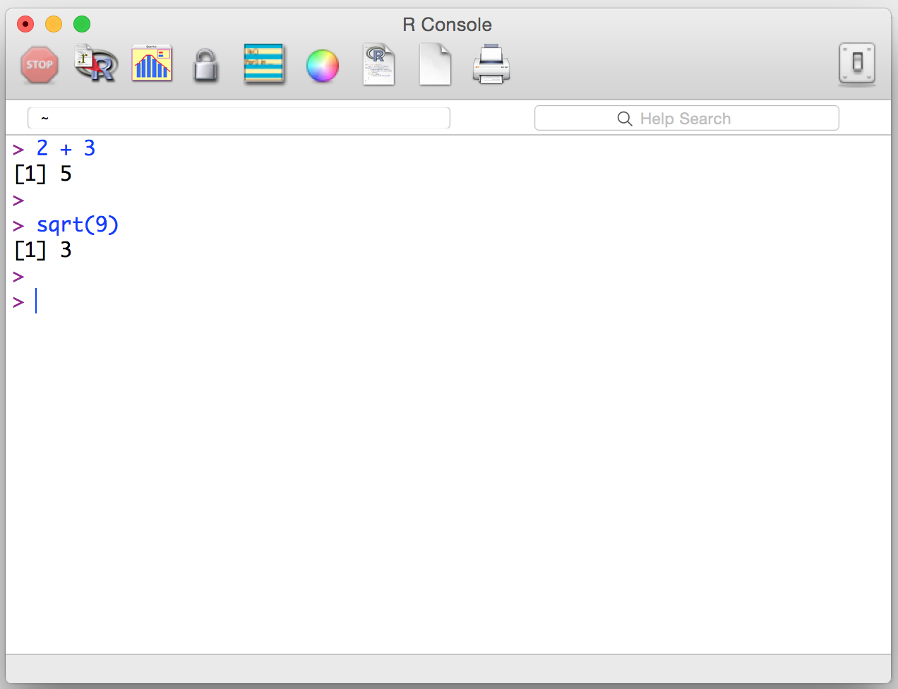
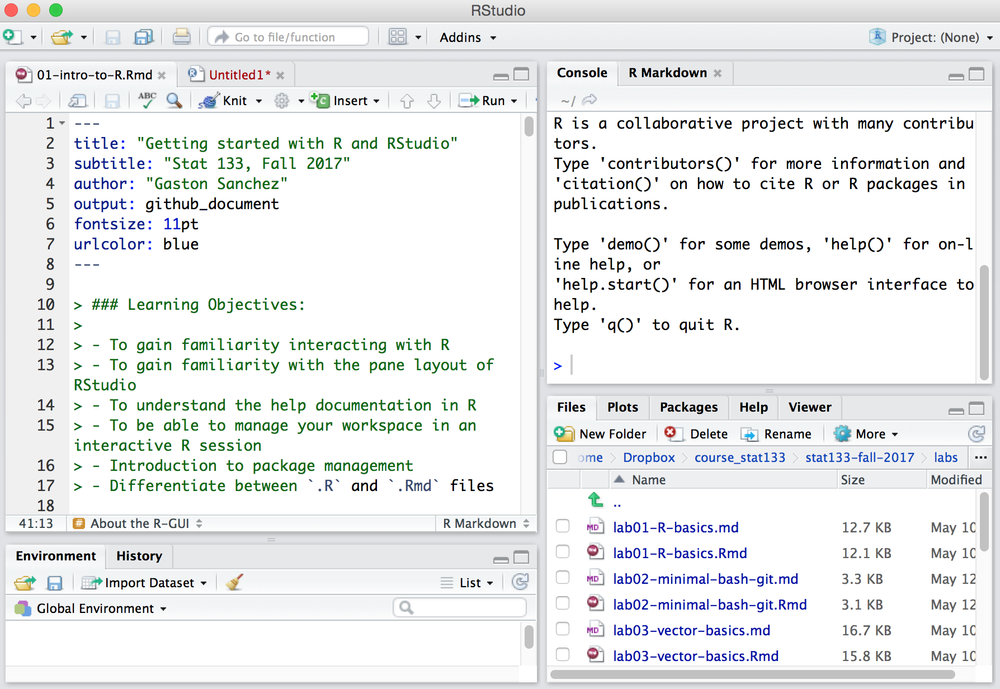
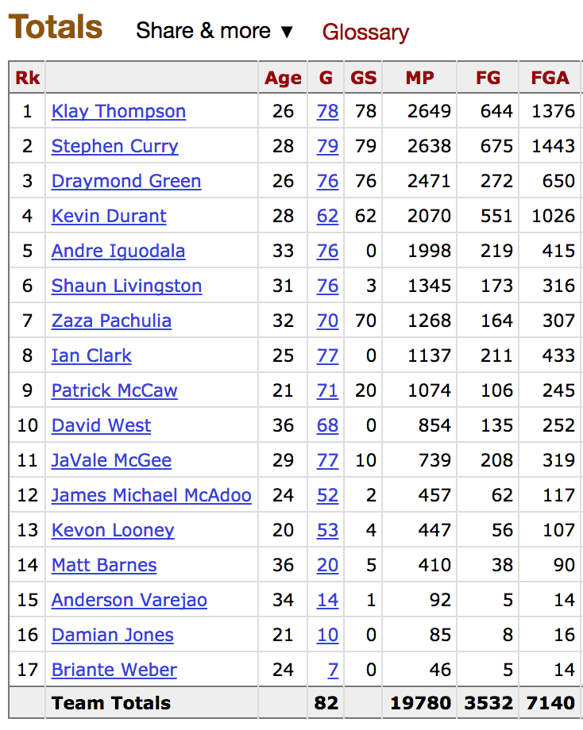
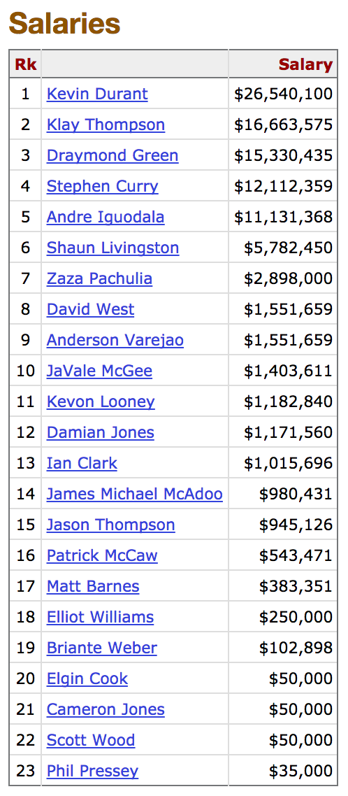

> ### Learning Objectives:
>
> - To gain familiarity interacting with R
> - To gain familiarity with the pane layout of RStudio
> - To understand the help documentation in R
> - To be able to manage your workspace in an interactive R session
> - Introduction to package management
> - Differentiate between `.R` and `.Rmd` files

```{r echo = FALSE, message = FALSE, warning = FALSE}
library(ggplot2)
```

------

## R and RStudio

I'm assuming that you already installed R and RStudio. If that is not the case, you can check these links and follow the corresponding instructions:

- Install __R__
	- R for Mac: [https://cran.r-project.org/bin/macosx/](https://cran.r-project.org/bin/macosx/)
	- R for windows: [https://cran.r-project.org/bin/windows/base/](https://cran.r-project.org/bin/windows/base/)
- Install __RStudio__
	- RStudio download: [https://www.rstudio.com/products/rstudio/download/](https://www.rstudio.com/products/rstudio/download/)


### About the R-GUI

When you install R, it comes with a basic graphical user interface (GUI).
Launching the R-GUI will let you interact with R in a "minimalist" way.



Nowadays, however, it is more convenient to interact with R through a more advanced and 
sophisticated development environment like RStudio.



Difference between R-GUI and RStudio:

- R-GUI is a simple graphical user interface.
- RStudio is an _Integrated Development Environment_ (IDE).
	- It is much more than a simple GUI.
	- It provides a nice working environment and development framework.
- In this course you are going to use mainly RStudio.
- But remember: RStudio is NOT R!
- RStudio is like an outer layer that makes it easy to interact with R.

-----

## The R Console

For the most part in this course, you are going to be working with R in what is 
called __interactive mode__. This means establishing a _dialogue_ between you 
and R. How? By writing commands, executing them, checking the output, and 
repeating these steps again, and again, until you get the job done. 
The main device to establish this interaction is the so-called __console__.
This is where commands get executed, and it is also the place where most outputs 
get displayed.

There are various ways to work with R in interactive mode (via its console):

- Using the basic R-GUI.
- Using R via RStudio (or any other IDE).
- Using R via a terminal emulator (e.g. command line).

Just for illustration purposes, I will briefly show you the basic R-GUI. 
However, your main workbench will be RStudio.

-----

## NBA Player Data Set

To have a working example that allows us to introduce and discuss many of the concepts in this course, I will make extensive use of data about NBA players from the regular season 2016-2017 (without play-offs). The main source is the website [http://www.basketball-reference.com](http://www.basketball-reference.com).

To make things more concrete, let's focus on data about the Golden State Warriors. Below are two screenshots; the first one shows part of the season statistics, and the second one shows the player salaries:

- `Rk`: Rank of player
- Name of player
- `Age` of player
- `G` number of games played
- `GS` nuber of games started
- `MP` minutes played
- `FG` number of field goals (3-pts and 2-pts shots)
- `FGA` number of field goal attempts







In this tutorial, let's consider a seemingly simple research question:

> The more points a player scores, the higher his salary?


-----

## R as a scientific calculator

The most recommended way to break the ice with R is by using it as a 
scientific calculator. 
Open RStudio and locate the _console_ (or prompt).
Let's start typing basic calculations in the console:

- addition

```r
1 + 1
2 + 3
```

-  subtraction

```r
4 - 2
5 - 7
```

- multiplication

```r
10 * 0
7 * 7
```

- division

```r
9 / 3
1 / 2
```

- power

```r
5 ^ 2
2 ^ 3
```


### Functions

R has many functions. To use a function, type its name followed by parenthesis.
Inside the parenthesis you pass one or more inputs. Most functions will display 
some sort of output on the console:

- absolute value

```{r}
abs(-4)
```

- square root

```{r}
sqrt(9)
```

- natural logarithm

```{r}
log(2)
```


## Variables and Assignments

R is more powerful than a calculator, and you can do many more things than
practically most scientific calculators. One of the things you will be
doing a lot in R is creating variables or objects to store values.

For instance, you can create a variable `thompson` and give it the value of Field Goals made by Klay Thompson (644).
This is done using what is known as the __assignment operator__ `<-`,
also known in R as the _arrow_ operator:

```{r}
thompson <- 644
thompson
```

This is a way to tell R: create an object `thompson` and store in it the number 644.
Alternatively, you can use the equals sign `=` as an assignment operator. Here's how to create a variable (or object) `curry`:

```{r}
curry = 675
curry
```

With variables, you can operate in the same way you do algebraic operations:

```{r}
thompson + curry
thompson - curry
thompson * curry
thompson / curry
```


### Case Sensitive

R is case sensitive. This means that `abs()` is not the same
as `Abs()` or `ABS()`. Only the function `abs()` is the valid one.
When working with variables and objects, make sure you are calling the 
right name:

```{r}
# case sensitive
green <- 272
durant <- 551
Durant <- 0

green + durant
green + Durant
durant + Durant
```


### Comments in R

All programming languages use a set of characters to indicate that a
specifc part or lines of code are __comments__, that is, things that are
not to be executed. R uses the hash or pound symbol `#` to specify comments.
Any code to the right of `#` will not be executed by R.

```r
# this is a comment
# this is another comment
thompson + curry

thompson + curry + green  # you can place comments like this
```


### Some Examples

Here are some examples that illustrate how to use R to define
variables and perform basic calculations:

```{r}
# convert Fahrenheit degrees to Celsius degrees
fahrenheit <- 50
celsius <- (fahrenheit - 32) * (5/9)
print(celsius)


# compute the area of a rectangle
rec_length <- 10
rec_height <- 5
rec_area <- rec_length * rec_height
rec_area


# degrees to radians
deg <- 90
rad <- (deg * pi) / 180
rad
```


-----

## More about RStudio

You will be working with RStudio a lot, and you will have time to learn
most of the bells and whistles RStudio provides. Think about RStudio as
your "workbench". Keep in mind that RStudio is NOT R. RStudio is an environment
that makes it easier to work with R, while taking care of many of
the little tasks than can be a hassle.


### A quick tour of RStudio

- Understand the __pane layout__ (i.e. windows) of RStudio
	- Source
	- Console
	- Environment, History, etc
	- Files, Plots, Packages, Help, Viewer
- Customize RStudio Appearance of source pane
  - font
  - size
  - background


### Getting help

Because we work with functions all the time, it's important to know certain
details about how to use them, what input(s) is required, and what is the
returned output.

There are several ways to get information about a function in R. We refer to 
this as "getting help".

If you know the name of a function you are interested in knowing more,
you can use the function `help()` and pass it the name of the function you
are looking for:

```{r eval = FALSE}
# documentation about the 'abs' function
help(abs)

# documentation about the 'mean' function
help(mean)
```

Alternatively, you can use a shortcut using the question mark `?` followed
by the name of the function:

```r
# documentation about the 'abs' function
?abs

# documentation about the 'mean' function
?mean
```

- Anatomy of the manual documentation of a function:
	- Title
	- Description
	- Usage of function
	- Arguments
	- Details
	- See Also
	- Examples!!!

`help()` only works if you know the name of the function your are looking for.
Sometimes, however, you don't know the name but you may know some keywords.
To look for related functions associated to a keyword, use `help.search()` or 
simply a double question mark: `??`

```r
# search for 'absolute'
help.search("absolute")

# alternatively you can also search like this:
??absolute
```
Notice the use of quotes surrounding the input name inside `help.search()`


### Example: NBA Player Variables

Let's go back to the Warriors data. Often, you want to create variables or objects that store more than one value. One way to do this in R is with __vectors__, which is the most basic data structure. To create a vector you can use the _combine_ function `c()` by passing different values separated by comma:

```{r}
# last name
player <- c('Thompson', 'Curry', 'Green', 'Durant', 'Iguodala')

# field goals
goals <- c(644, 675, 272, 551, 219)

# salary (dollars)
salary <- c(16663575, 12112359, 15330435, 26540100, 11131368)
```

In this case we don't really have all the points scored by each player but we have information about the field goals (combined number of 2-points and 3-points goals).

In order to investigate our research question, we can start visualizing the data with a scatterplot of `goals` and `salary` using the function `plot()`:

```{r}
plot(goals, salary)
text(goals, salary, labels = player)
```

Furthermore, we can calculate the correlation coefficient:

```{r}
cor(goals, salary)
```


### Installing Packages

R comes with a large set of functions and packages. A package is a collection
of functions that have been designed for a specific purpose. One of the great
advantages of R is that many analysts, scientists, programmers, and users
can create their own pacakages and make them available for everybody to use them.
R packages can be shared in different ways. The most common way to share a
package is to submit it to what is known as __CRAN__, the
_Comprehensive R Archive Network_.

You can install a package using the `install.packages()` function.
Just give it the name of a package, surrounded by qoutes, and R will look for
it in CRAN, and if it finds it, R will download it to your computer.

```r
# installing
install.packages("knitr")
```

You can also install a bunch of packages at once:

```r
install.packages(c("readr", "ggplot2"))
```

Once you installed a package, you can start using its functions
by _loading_ the package with the function `library()`

```r
library("knitr")
library("ggplot2")
```

Notice that when invoking `library()`, you can type the name of the package without using quotes:

```r
# no quotes
library(knitr)
library(ggplot2)
```


### Example: Plots for NBA data

The package `"ggplot2"` provides a wide range of functions to create nicer graphics than those offered in base R. We will cover how the functions in `"ggplot2"` work in a couple of weeks. In the meantime, here's some sample code to create a more visually apealing scatterplot:

```{r}
dat <- data.frame(
  player = player,
  goals = goals,
  salary = salary
)

dat
```

Scatter plot with `ggplot2()`

```{r}
ggplot(data = dat, aes(x = goals, y = salary)) + 
  geom_point() + 
  geom_text(aes(label = player))
```


### Quitting a session

To quit an R session, you can simply type the function `quit()` or its
abbreviated version `q()`. 

By default, every time you quit a session, R will ask you if you want to
save your __workspace image__. What does this mean? Your _workspace_ involves 
all the objects that you've created in your current session. A _workspace image_, 
in turn, is a special type of R file. This is actually a binary file 
(using R's native binary format), and the default file extension is `.RData`.
You can only open these files with R.

The workspace only contains the objects (variables, data objects, functions 
that you have created). But it does not contain all the commands that you've 
been invoking. The invoked commands, are actually in a separate file.

R keeps a log of all the commands that you've used in the current (and past) 
session(s). This log is known as the __history__, and R keeps this information 
in another special file called by default `.Rhistory`. In RStudio, you can 
actually see the history of your commands in the pane that has the tabs 
`Environment` and `History`.

`.Rhistory` is a simple text file, and you should be able to find it in your 
working directory.

-----

## Source Files

Most of the times you won't be working directly on the console.
Instead, you will be typing your commands in some source file.
The basic type of source files are known as _R script_ files, commonly 
referred to as `.R` files. Another type of source file that is becoming quite 
popular are _R Markdown_ files or `.Rmd` files.


### Using an R script file

Open a new script file in the _source_ pane and let's rewrite some of the 
previous commands.

How do you execute the commands in your source file? You can copy the commands 
in your source file and paste them in the console. But that's not very efficient. Alternatively, you can run (execute) the commands with some keyboard shortcuts. 
Or you can also use some buttons in RStudio (look for the "Run" icon).

In the next tutorial we'll see how to use the so-called `Rmd` files:
[Getting Started with R Markdown files](02-intro-to-Rmd-files.md)

-----
