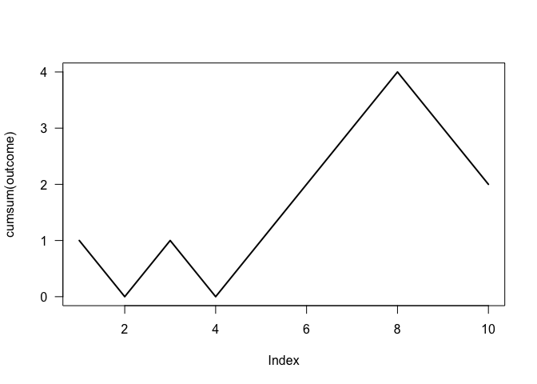
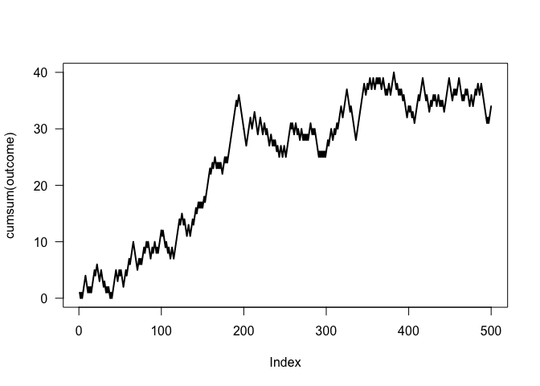

More Simple Simulations
================
Gaston Sanchez

> ### Learning Objectives
>
> -   How to use R to simulate chance processes
> -   Getting to know the function `sample()`
> -   Simulate flipping a coin
> -   Simulate rolling a die
> -   Simulate drawing tickets from a box

Simulating rolling a die
------------------------

In the last tutorial we discussed how to use R in order to simulate tossing a coin one or more times. We can extend this idea and adapt the coin example to simulate rolling a die.

The first step has to do with creating a `die` object. This can be easily done with a numeric sequence from 1 to 6:

``` r
# die object
die <- 1:6
die
```

    ## [1] 1 2 3 4 5 6

Once we have our `die` object, we can use the `sample()` function to simulate rolling the die:

``` r
# rolling a die once
sample(die, size = 1)
```

    ## [1] 3

``` r
# rolling a pair of dice
sample(die, size = 2, replace = TRUE)
```

    ## [1] 4 6

``` r
# rolling a die 5 times
sample(die, size = 5, replace = TRUE)
```

    ## [1] 3 1 1 4 4

It would be more convenient to encapsulate the `sample()` call into an ad-hoc function `roll()`

``` r
# function roll
roll <- function(x, times = 1) {
  sample(x, size = times, replace = TRUE)
}
```

The function `roll()` is more descriptive (and meaningful):

``` r
# roll a die once
roll(die)
```

    ## [1] 3

``` r
# roll a die 5 times
roll(die, times = 5)
```

    ## [1] 6 5 3 1 4

De Mere's Game
--------------

French gamblers in the 1700's used to play a popular game of dice: bet on the event of getting at least one 6 in four rolls of a die. We can play this game using our `die` and `roll()` objects:

``` r
set.seed(2)
game1 <- roll(die, times = 4)
game2 <- roll(die, times = 4)
```

In the first game, we lose because we get no sixes:

``` r
# lose
game1
```

    ## [1] 2 5 4 2

In the second game, we win because we get at least 1 six:

``` r
# win
game2
```

    ## [1] 6 6 1 6

### Probability of Winning

The probability of winning the dice game can be calculated as follow. First considered the winning condition: *getting at least one 6*. What does this involve? Getting at least one 6 in four rolls involves: one 6, or two 6's, or three 6's, or four 6's. Which can also be put in terms of the complement event *getting no 6's in four rolls*.

    Prob(at least one 6 in four rolls) = 1 - Prob(no 6 in four rolls)

We can assume that all rolls are independent: what happens in a given roll, should not be affected by what happened in the previous roll; and it should also not affect what will happen in the next roll. Hence we can use the multiplication rule:

    Prob(at least one 6 in four rolls) = 1 - Prob(no 6 in four rolls) =
    1 - Prob(no 6) Prob(no 6) Prob(no 6) Prob(no 6) = 1 - (5/6)^4

``` r
# prob of winning
1 - (5/6)^4
```

    ## [1] 0.5177469

This means that if you play the game a large number of times, you should expet to obtain a positive gain.

Let's see what could happen if we play the game 10 times:

``` r
set.seed(5)
games <- 10
outcome <- rep(0, games)

for (g in 1:games) {
  rolls <- roll(die, times = 4)
  # count number of sixes
  sixes <- sum(rolls == 6)
  # win or lose?
  if (sixes >= 1) {
    outcome[g] <- 1  # win 
  } else {
    outcome[g] <- -1  # lose
  }
}

outcome
```

    ##  [1]  1 -1  1 -1  1  1  1  1 -1 -1

To find out the net gain, we add all the outcome values:

``` r
# net gain
gain <- sum(outcome)
gain
```

    ## [1] 2

The next stage consists of visualizing the net gain in a series of games:

``` r
plot(cumsum(outcome), type = 'l', lwd = 2, las = 1)
```



Let's play the game a large number of times:

``` r
set.seed(5)
games <- 500
outcome <- rep(0, games)

for (g in 1:games) {
  rolls <- roll(die, times = 4)
  # count number of sixes
  sixes <- sum(rolls == 6)
  # win or lose?
  if (sixes >= 1) {
    outcome[g] <- 1  # win 
  } else {
    outcome[g] <- -1  # lose
  }
}

plot(cumsum(outcome), type = 'l', lwd = 2, las = 1)
```


