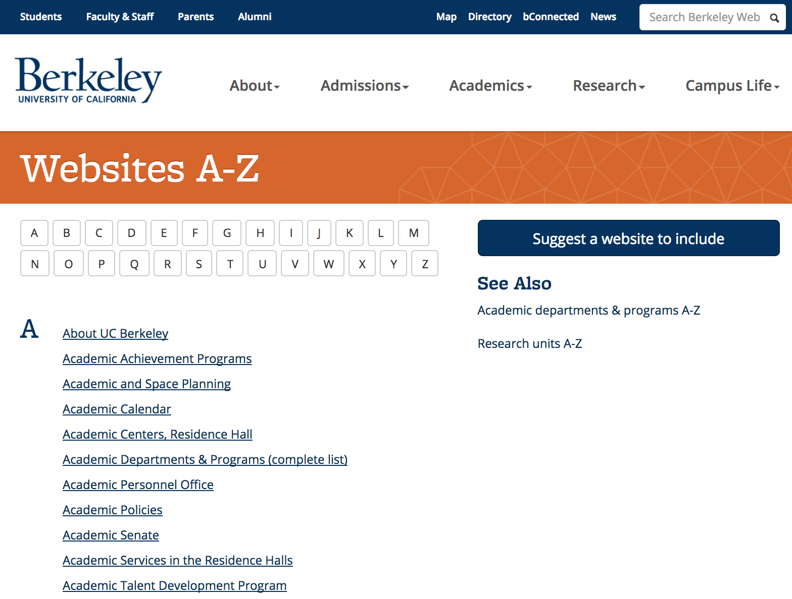

> ### Learning Objectives:
>
> - First contact with `"rvest"`
> - Parsing a web page
> - Extracting html elements

------


```{r setup, include=FALSE}
knitr::opts_chunk$set(echo = TRUE)
library(xml2)
library(rvest)
```


## Introduction

This tutorial provides a crash introduction to web scraping and a first contact
with R the package `"rvest"`. 

```{r eval = FALSE}
# install.packages(rvest)
library(rvest)
```

You'll be working with the __UC Berkeley Websites__ page:

[http://www.berkeley.edu/atoz](http://www.berkeley.edu/atoz)



The goal is to scrape all the names of the websites (e.g. _About UC Berkeley_, 
_Academic Achievement Programs_, _Academic and Space Planning_)
as well as as well as their URLs.


### Get a copy of the _UC Berkeley Websites_ page

When doing web scraping, as with any other programming and data computing tasks,
__always start small__ (e.g. with some "toy" example). In particular, when 
dealing data from the web, whenever possible, I recommend getting a 
local copy of the xml/html document you want to work with:

```{r, eval=FALSE}
# uc websites
uc_webs <- 'http://www.berkeley.edu/atoz'

# download html file to your working directory
download.file(uc_webs, 'atoz.html')
```

-----


### Option 

Assuming that you have a local copy of the _UC Berkeley Websites_ content,
one way to read the content of the html file is using the function `readLines()`

```{r echo = FALSE}
html_doc <- readLines('../data/atoz.html')
```

```{r eval = FALSE}
# read content as character vector
html_doc <- readLines('atoz.html')
```

`readLines()` allows you to read ANY text file in R; the output is always a 
character vector. Now, keep in mind that using `readLines()` to import an 
html/xml document is very low level.

The first step involves selecting the content of the html _body_; recall that 
the body is all the content inside the html tags `<body>...</body>`. How do we
do this? Again, using this very low level approach, you would have to look 
for the `<body>` tags and match them with regular expressions.

It turns out that the openning body tag is `"<body class=\"search\">"`, which
can be matched with the following regex pattern:

```{r}
# selecting the body
begin <- grep("<body.*>", html_doc) + 1
end <- grep("</body.*>", html_doc) - 1
html_body <- html_doc[ begin : end]
```

Say we want to select those lines with elements of the type `<p class="A">`:

```{r}
pas <- grep('<p class="A">', html_doc, value = TRUE)
```


-----

## R package `"rvest"`

The package `"rvest"` is one of the packages in R that allows you to parse 
and extract content from an xml/html document in a more convenient way rather
than using complicated regular expressions.

```{r echo = FALSE}
html_doc <- read_html('../data/atoz.html')
```

To read the content of an html file, you use `read_html()`

```{r eval = FALSE}
html_doc <- html_read('atoz.html')
```

The output of `html_read()` is an object of type `"xml_document"`.


### DOM

DOM is the acronym for _Document Object Model_. This is the fancy name used for
the hierarchical representation of the structure in a web page. Because this
structure can be represented as a tree, each element of the tree is referred 
to as a __node__.


### `id` and `class`

- `id` and `class` are a special type of html attributes.
- These attributes make reference to the CSS (cascade style sheet)
- `id` refers to a unique element in a DOM
- `class`, in turn, can be applied to various html elements
- In the CSS specifications, an `id` is defined with the `#` symbol, while a
`class` is defined with a dot `.`

For example, consider the names of those websites starting with the letter _A_. If you look 
at the source code of the webpage, you will notice that all these names are 
inside _paragraph_ elements (`<p>`) of class `"A"`, that is: `<p class="A">`. This means that you can refer to these elements with the notation `p.A`

As an example of an element with an `id` consider one of the `<div>` elements: `<div id="content" role="main">`. This element can be referred with the notation `div#id` 


## Selecting Nodes

`"rvest"` provides the function `html_nodes()` that allows you to select specific
nodes. The first argument is an object of type `"xml_document"`, the second 
argument can be a `css` node or an `xpath` expression.

Let's begin with `css` nodes. One way to extract nodes is by passing the name
of the name. For example, here's how to _extract_ all the paragraphs of class 
`"A"`:

```{r}
paragraphs_A <- html_nodes(html_doc, "p.A")
```

And of course you can also extract paragraphs `<p class="B">`

```{r}
paragraphs_B <- html_nodes(html_doc, "p.B")
```


## XPath expressions

The other way to specify nodes with `html_nodes()` is using what is known as
an `xpath` expression:

- XPath is a language to navigate through the elements and attributes in an 
XML/HTML document.
- XPath uses path expressions to select nodes in an XML 
document.
- XPath has a computational model to identify sets of nodes (node-sets)

XPath expressions have a syntax similar to the way files are located in a 
hierarchy of directories/folders in a computer file system. 

We can specify paths through the tree structure:

- based on node names
- based on node content
- based on a node's relationship to other nodes

| Symbol  | Description                |
|---------|----------------------------|
|  `/`    | selects from the root node |
|  `//`   | selects nodes anywhere     |
|  `.`    | selects the current node   |
|  `..`   | Selects the parent of the current node |
|  `@`    | Selects attributes         |
|  `[]`   | Square brackets to indicate attributes |


For instance,
we can match all the `<p class="A">` elements, anywhere in the document, with 
the following __XPath__ pattern:

```
'//p[@class="A"]'
```

Likewise, we can match all the `<p class="B">` nodes, anyhwere in the document, 
with the following __XPath__ pattern:

```
'//p[@class="B"]'
```

Here's how to get all paragraphs of class `"B"` with `html_nodes()`

```{r}
paragraphs_B <- html_nodes(html_doc, xpath = '//p[@class="B"]')
```


## Extracting content

So how do we extract the names of the websites starting with letter _A_?
The idea is to identify (i.e. select) the anchor elements `<a href=...>`
inside the nodes `<p class="A">`, and then use `html_text()` to retrieve 
the text:

```{r}
# names of websites A
websites_A <- html_doc %>% 
  html_nodes(xpath = '//p[@class="A"]/a') %>%
  html_text()

head(websites_A)
```

The same output can be obtained like this:

```{r}
# names of websites A
websites_A <- html_doc %>% 
  html_nodes("p.A") %>%
  html_nodes("a") %>%
  html_text()

head(websites_A)
```


## Extracting attributes

Another common task when working with xml/html documents is to extract the
values of certain attributes. To do this, `"rvest"` provides the function
`html_attr()`

```{r}
# href values
hrefs_A <- html_doc %>% 
  html_nodes(xpath = '//p[@class="A"]/a') %>%
  html_attr("href")

head(hrefs_A)
```

